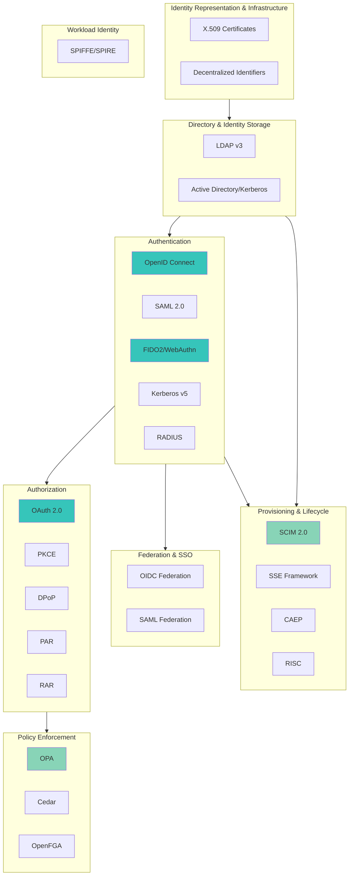

# IAM Functional Architecture Mapped to Open Standards

**Answering the question:** *"Is there a vendor-agnostic IAM architecture mapped to open standards and projects?"*

This page maps Identity and Access Management functional processes to the open standards that support them, showing which standards address which parts of your IAM architecture.

## IAM Functional Architecture Layers



## Standards-to-Processes Mapping Table

| IAM Functional Process | Standards Supporting This Process | Coverage Level |
|------------------------|-----------------------------------|----------------|
| **Identity Representation** | [X.509](./standards/x509.md), [DIDs](./standards/dids.md), [Verifiable Credentials](./standards/verifiable-credentials.md) | ✅ Excellent |
| **Directory Management** | [LDAP](./standards/ldap.md), [Kerberos](./standards/kerberos.md) | ✅ Mature (legacy but stable) |
| **Authentication** | [OpenID Connect](./standards/openid-connect.md), [SAML 2.0](./standards/saml.md), [FIDO2/WebAuthn](./standards/fido2-webauthn.md), [Kerberos](./standards/kerberos.md), [RADIUS](./standards/radius.md) | ✅ Excellent (multiple options) |
| **Authorization (API)** | [OAuth 2.0](./standards/oauth-2.0.md), [PKCE](./standards/pkce.md), [DPoP](./standards/dpop.md), [PAR](./standards/par.md), [RAR](./standards/rar.md) | ✅ Excellent (mature ecosystem) |
| **Authorization (Policy)** | [OPA](./standards/opa.md), [Cedar](./standards/cedar.md), [OpenFGA](./standards/openfga.md), [XACML](./standards/xacml.md) | ✅ Good (multiple modern options) |
| **Federation & SSO** | [OpenID Connect](./standards/openid-connect.md), [SAML 2.0](./standards/saml.md) | ✅ Excellent |
| **Provisioning** | [SCIM 2.0](./standards/scim.md) | ✅ Good (universal for cloud) |
| **Lifecycle Management** | [SCIM 2.0](./standards/scim.md), [SSE](./standards/sse.md), [CAEP](./standards/caep.md), [RISC](./standards/risc.md) | ⚠️ Emerging (real-time signals) |
| **Security Profiles** | [FAPI 2.0](./standards/fapi.md), [JAR](./standards/jar.md), [JARM](./standards/jarm.md) | ✅ Good (industry-specific) |
| **Workload Identity** | [SPIFFE/SPIRE](./standards/spiffe-spire.md) | ⚠️ Emerging (cloud-native) |
| **Decentralized Identity** | [DIDs](./standards/dids.md), [VCs](./standards/verifiable-credentials.md), [OpenID4VC](./standards/openid4vc.md), [SD-JWT](./standards/sd-jwt.md) | ⚠️ Emerging (government-driven) |

## Complete IAM Architecture Stacks

### Enterprise Stack (Traditional)

```
┌─────────────────────────────────────┐
│ Identity Storage                     │
│ ├── LDAP (directory)                │
│ └── Kerberos (on-prem auth)         │
└─────────────────────────────────────┘
           ↓
┌─────────────────────────────────────┐
│ Authentication                       │
│ ├── SAML 2.0 (B2B, legacy)          │
│ ├── OIDC (modern apps)              │
│ └── RADIUS (WiFi/VPN)               │
└─────────────────────────────────────┘
           ↓
┌─────────────────────────────────────┐
│ Authorization                        │
│ ├── OAuth 2.0 + PKCE (APIs)         │
│ └── OPA (microservices policy)      │
└─────────────────────────────────────┘
           ↓
┌─────────────────────────────────────┐
│ Provisioning                         │
│ └── SCIM 2.0 (cloud apps)           │
└─────────────────────────────────────┘
```

### Cloud-Native Stack (Modern)

```
┌─────────────────────────────────────┐
│ Authentication                       │
│ ├── OIDC (users)                    │
│ ├── FIDO2/Passkeys (passwordless)   │
│ └── SPIFFE/SPIRE (workloads)        │
└─────────────────────────────────────┘
           ↓
┌─────────────────────────────────────┐
│ Authorization                        │
│ ├── OAuth 2.0 + PKCE + DPoP         │
│ └── OPA or Cedar (policy)           │
└─────────────────────────────────────┘
           ↓
┌─────────────────────────────────────┐
│ Provisioning & Signals               │
│ ├── SCIM 2.0 (provisioning)         │
│ └── CAEP/SSE (continuous eval)      │
└─────────────────────────────────────┘
```

### Financial Services Stack (FAPI-Compliant)

```
┌─────────────────────────────────────┐
│ Authentication                       │
│ └── OIDC + PKCE                     │
└─────────────────────────────────────┘
           ↓
┌─────────────────────────────────────┐
│ Authorization (High Security)        │
│ ├── OAuth 2.0 (framework)           │
│ ├── PKCE (mandatory)                │
│ ├── PAR (mandatory)                 │
│ ├── DPoP or mTLS (mandatory)        │
│ ├── RAR (transaction details)       │
│ └── FAPI 2.0 (security profile)     │
└─────────────────────────────────────┘
           ↓
┌─────────────────────────────────────┐
│ Infrastructure                       │
│ └── X.509 (TLS + client auth)       │
└─────────────────────────────────────┘
```

## Process-to-Standards Detailed Mapping

### 1. Identity Representation

**Process:** How identities are described and represented

**Standards:**
- **[X.509](./standards/x509.md)** - Digital certificates (Universal)
- **[DIDs](./standards/dids.md)** - Decentralized identifiers (Emerging)
- **[Verifiable Credentials](./standards/verifiable-credentials.md)** - Digital credentials (Growing)

**Coverage:** ✅ Excellent - Multiple approaches for different use cases

### 2. Directory & Identity Storage

**Process:** How identity information is stored, organized, and retrieved

**Standards:**
- **[LDAP v3](./standards/ldap.md)** - Directory protocol (Widely Implemented)
- **[Kerberos v5](./standards/kerberos.md)** - With LDAP in Active Directory (Widely Implemented)

**Coverage:** ✅ Mature - Legacy but stable, cloud directories emerging

### 3. Authentication

**Process:** Verifying user/service identity

**Standards:**
- **[OpenID Connect](./standards/openid-connect.md)** - Modern web/mobile/API auth (Universal)
- **[SAML 2.0](./standards/saml.md)** - Enterprise SSO, B2B federation (Widely Implemented)
- **[FIDO2/WebAuthn](./standards/fido2-webauthn.md)** - Passwordless (Widely Implemented, rapidly growing)
- **[Kerberos v5](./standards/kerberos.md)** - Enterprise networks (Widely Implemented)
- **[RADIUS](./standards/radius.md)** - Network access (WiFi/VPN) (Widely Implemented)

**Coverage:** ✅ Excellent - Multiple mature options for different scenarios

### 4. Authorization (API Access)

**Process:** Controlling what authenticated entities can access

**Standards:**
- **[OAuth 2.0](./standards/oauth-2.0.md)** - Authorization framework (Universal)
- **[PKCE](./standards/pkce.md)** - Code protection, mandatory (Universal)
- **[DPoP](./standards/dpop.md)** - Token binding (Growing)
- **[PAR](./standards/par.md)** - Request confidentiality (Growing)
- **[RAR](./standards/rar.md)** - Fine-grained permissions (Growing)
- **[FAPI 2.0](./standards/fapi.md)** - Financial-grade profile (Widely Implemented in finance)

**Coverage:** ✅ Excellent - Mature ecosystem with security extensions

### 5. Authorization (Policy-Based)

**Process:** Fine-grained access control using policies

**Standards:**
- **[OPA](./standards/opa.md)** - Cloud-native policy (Growing, Kubernetes focus)
- **[Cedar](./standards/cedar.md)** - Formally verified (Emerging, AWS)
- **[OpenFGA](./standards/openfga.md)** - Relationship-based (Growing)
- **[XACML 3.0](./standards/xacml.md)** - XML-based (Legacy/Declining)

**Coverage:** ✅ Good - Multiple modern options, choose based on use case

### 6. Provisioning & Lifecycle

**Process:** Creating, updating, deleting user accounts across systems

**Standards:**
- **[SCIM 2.0](./standards/scim.md)** - User provisioning (Widely Implemented)
- **[SSE Framework](./standards/sse.md)** - Real-time security signals (Emerging)
- **[CAEP](./standards/caep.md)** - Continuous access evaluation (Emerging)
- **[RISC](./standards/risc.md)** - Risk incident sharing (Emerging)

**Coverage:** ✅ Good for provisioning, ⚠️ Emerging for real-time signals

### 7. Federation & Single Sign-On

**Process:** Authentication across organizational boundaries

**Standards:**
- **[OpenID Connect](./standards/openid-connect.md)** - Modern federation (Universal)
- **[SAML 2.0](./standards/saml.md)** - Enterprise federation (Widely Implemented)

**Coverage:** ✅ Excellent - Both modern (OIDC) and legacy (SAML) well-supported

### 8. Workload & Service Identity

**Process:** Authenticating services and workloads (non-human)

**Standards:**
- **[SPIFFE/SPIRE](./standards/spiffe-spire.md)** - Cloud-native workload identity (Growing)
- **[OAuth 2.0](./standards/oauth-2.0.md)** - Client Credentials flow (Universal)
- **X.509 + mTLS** - Certificate-based service auth (Universal)

**Coverage:** ✅ Growing - SPIFFE maturing, OAuth Client Credentials universal

## Gaps & Overlaps Analysis

### Well-Covered Areas (✅ Multiple Standards)

**API Authorization:**
- OAuth 2.0 (universal)
- Multiple security extensions (PKCE, DPoP, PAR, RAR)
- Industry profiles (FAPI for finance)
- **Verdict:** Mature, comprehensive coverage

**Authentication:**
- Modern: OIDC (universal)
- Legacy: SAML (widely implemented)
- Passwordless: FIDO2 (rapidly growing)
- Network: Kerberos, RADIUS (mature)
- **Verdict:** Excellent coverage across scenarios

**Federation:**
- OIDC (modern, mobile-friendly)
- SAML (enterprise, established)
- **Verdict:** Well-covered, both options viable

### Emerging Areas (⚠️ Standards Exist But Maturing)

**Continuous Access Evaluation:**
- CAEP, SSE Framework (specs finalized, limited production)
- **Gap:** Not yet universal, pilot deployments
- **Trend:** Zero Trust driving adoption

**Workload Identity:**
- SPIFFE/SPIRE (CNCF graduated, growing adoption)
- **Gap:** Not universal outside major tech companies
- **Trend:** Cloud-native focus increasing adoption

**Decentralized Identity:**
- DIDs, VCs, OpenID4VC (specs mature, government-driven)
- **Gap:** Ecosystem fragmentation (184 DID methods)
- **Trend:** EU eIDAS 2.0 mandate driving adoption

### Overlapping Standards (Choose Based on Context)

**Federation: SAML vs OIDC**
- **SAML:** Enterprise B2B, educational federations, government (20 years of investment)
- **OIDC:** Modern apps, mobile, APIs, better developer experience
- **Reality:** Organizations run BOTH (SAML for legacy, OIDC for new)
- **Recommendation:** OIDC for new implementations, maintain SAML where already deployed

**Policy Engines: OPA vs Cedar vs OpenFGA**
- **OPA:** General-purpose, Kubernetes focus, largest adoption
- **Cedar:** Formally verified, AWS ecosystem, provable security
- **OpenFGA:** Relationship-based (ReBAC), Google Zanzibar model
- **Reality:** Different use cases, not direct competitors
- **Recommendation:** OPA for Kubernetes/general, Cedar for AWS/formal verification, OpenFGA for collaborative apps

**Token Security: DPoP vs mTLS**
- **DPoP:** Application-layer, works in browsers, RFC 9449
- **mTLS:** Certificate-based, requires PKI infrastructure
- **Reality:** Alternatives for same goal (sender-constrained tokens)
- **Recommendation:** DPoP for web/mobile, mTLS for backend services

## Comparison to Existing Frameworks

### FICAM (Federal Identity, Credential, and Access Management)

**What FICAM Provides:**
- Federal government IAM architecture
- Policy and governance frameworks
- Trust framework for federal agencies
- **URL:** https://www.idmanagement.gov/

**Our Contribution:**
- Maps specific open standards (OAuth, OIDC, SAML, FIDO2) to FICAM processes
- Provides implementation guidance with open-source projects
- Covers commercial/enterprise scenarios beyond federal government
- Includes emerging standards (DIDs, VCs, SPIFFE) not in original FICAM

**Relationship:** Complementary - FICAM provides policy framework, we provide standards implementation roadmap

### AARC (Authentication and Authorisation for Research and Collaboration)

**What AARC Provides:**
- Research/education sector IAM architecture
- Focus on federated access for research
- Community-driven best practices
- **URL:** https://aarc-community.org/architecture/

**Our Contribution:**
- Broader industry coverage (financial, healthcare, government, enterprise, consumer)
- Comprehensive standards catalog (29 vs focused subset)
- Implementation details with open-source projects
- Historical evolution and future trends

**Relationship:** Complementary - AARC focuses on research/education federation, we cover all industries

### Our Unique Value

**What We Provide That FICAM/AARC Don't:**

1. **Comprehensive Standards Catalog:** 29 standards documented vs conceptual frameworks
2. **Multi-Industry:** Financial, Healthcare, Government, Enterprise, Consumer, Education
3. **Implementation Details:** Open-source projects, complexity ratings, setup guides
4. **Decision Support:** Decision trees, gap analysis, when to choose which standard
5. **Historical + Current + Future:** Evolution from 1988, current adoption, emerging trends
6. **Vendor-Agnostic:** Focus on open standards and open-source, not vendor products

**FICAM + AARC + This Guide = Complete IAM Knowledge**

## Reference Architecture Patterns

### Pattern 1: Modern Enterprise (Hybrid)

**Scenario:** Large enterprise with legacy systems + new cloud apps

**Architecture:**
- **Directory:** LDAP/Active Directory (existing investment)
- **Internal Auth:** Kerberos (Windows domains)
- **Cloud/SaaS Auth:** OIDC (modern apps)
- **B2B Federation:** SAML (existing partners) + OIDC (new partners)
- **API Authorization:** OAuth 2.0 + PKCE
- **Provisioning:** SCIM (cloud), manual/scripts (on-prem)
- **Policy:** OPA for microservices, AD groups for legacy

**Complexity:** High (bridging legacy + modern)

### Pattern 2: Cloud-Native Startup

**Scenario:** New company, all cloud/SaaS, no legacy

**Architecture:**
- **Authentication:** OIDC + Passkeys (FIDO2)
- **Social Login:** OIDC with Google, Microsoft, GitHub
- **API Authorization:** OAuth 2.0 + PKCE + DPoP
- **Provisioning:** SCIM 2.0
- **Policy:** OPA or Cedar
- **Workload Identity:** SPIFFE/SPIRE (if Kubernetes/microservices)

**Complexity:** Low-Medium (modern stack, no legacy)

### Pattern 3: Financial Services (FAPI)

**Scenario:** Bank, fintech, or Open Banking implementation

**Architecture:**
- **Authentication:** OIDC (iGov or FAPI profile)
- **Authorization:** OAuth 2.0 + FAPI 2.0 profile
  - PKCE (mandatory)
  - PAR (mandatory)
  - DPoP or mTLS (mandatory)
  - RAR (for payment details)
  - Token lifetime ≤15 minutes
- **Provisioning:** SCIM 2.0
- **Infrastructure:** X.509 for TLS + client authentication

**Complexity:** High (regulatory requirements, certification)

### Pattern 4: Healthcare (SMART on FHIR)

**Scenario:** EHR integration, patient portal, health apps

**Architecture:**
- **Authentication:** OIDC (SMART on FHIR profile)
- **Authorization:** OAuth 2.0 + PKCE + FHIR scopes
- **Provisioning:** SCIM 2.0
- **Data Access:** UMA 2.0 (patient-managed access)
- **Compliance:** HIPAA audit logging

**Complexity:** Medium-High (compliance, EHR integration)

### Pattern 5: Government/Citizen Services

**Scenario:** Digital government services, citizen authentication

**Architecture:**
- **Authentication:** OIDC (iGov profile)
- **Credentials:** DIDs + Verifiable Credentials (eIDAS 2.0)
- **Issuance/Presentation:** OpenID4VCI/VP
- **Legacy Federation:** SAML (inter-agency)
- **Compliance:** NIST 800-63 (AAL/IAL levels)

**Complexity:** High (regulation, interoperability)

## How to Use This Architecture Guide

### For Enterprise Architects

1. **Start with your scenario** (Enterprise, Cloud-Native, Financial, Healthcare, Government)
2. **Review reference architecture** matching your context
3. **Check standards coverage** for each functional layer
4. **Identify gaps** in your current architecture
5. **Plan migration** from legacy to modern standards where beneficial

### For Developers

1. **Understand functional layers** (what each process does)
2. **See which standards** address each layer
3. **Review implementation options** (open-source projects in Story 1.14)
4. **Follow decision trees** for specific recommendations

### For Compliance/Risk

1. **Map regulations** to functional processes
2. **Identify required standards** per regulation
3. **Verify coverage** in your architecture
4. **Use compliance tables** in industry guides

---

## See Also

- [Standards Catalog](./standards/) - All 29 standards detailed
- [Open Source Projects Matrix](./implementations.md) - Story 1.14
- [Industry Guides](./industries/financial-services.md) - Sector-specific stacks
- [Decision Trees](./guides/which-authentication-standard.md) - Quick recommendations

---

**Acknowledgments:**
- **FICAM:** US Federal IAM framework (https://www.idmanagement.gov/)
- **AARC:** Research/Education IAM architecture (https://aarc-community.org/architecture/)
- **Community:** LinkedIn discussion that inspired this comprehensive mapping

---

**Last Updated:** 2025-10-19
