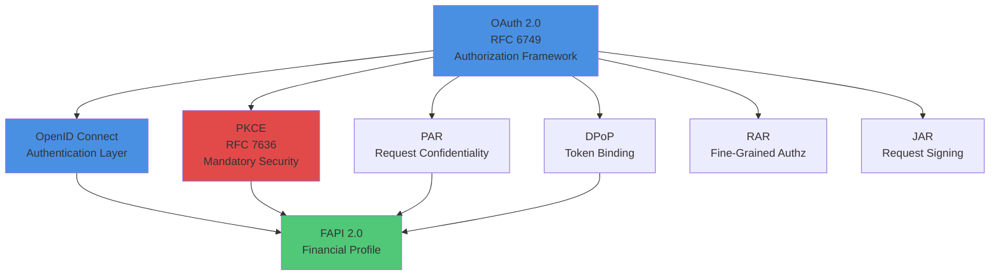
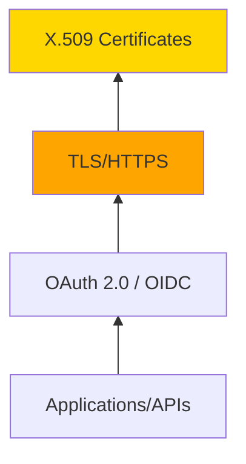

# Standards Relationships & Technology Stacks

Understanding how IAM standards relate to each other is crucial for building complete, secure architectures. This page maps dependencies, complementary relationships, and common technology stacks.

## OAuth 2.0 Ecosystem

OAuth 2.0 serves as the foundation for modern authorization, with numerous extensions and profiles building upon it:



**Key Relationships:**
- **OIDC builds on OAuth 2.0:** Adds authentication (ID tokens) to authorization framework
- **PKCE is mandatory:** Required for all OAuth flows in OAuth 2.1
- **FAPI combines multiple:** FAPI 2.0 = OAuth + OIDC + PKCE + PAR + (DPoP or mTLS)

## Foundational Dependencies



**Every modern authentication/authorization flow depends on:**
1. **X.509:** Certificate infrastructure (proves server identity)
2. **TLS/HTTPS:** Encrypted transport (protects data in transit)
3. **OAuth/OIDC:** Authorization and authentication protocols
4. **Applications:** Consume OAuth/OIDC for access control

## Functional Layers

Standards operate at different layers of the IAM stack:

### Identity Representation & Infrastructure
- **X.509:** Digital certificates, PKI foundation
- **DIDs:** Decentralized identifiers

### Directory & Identity Storage
- **LDAP:** Directory protocol, attribute storage
- **Active Directory:** Microsoft's LDAP implementation

### Authentication
- **Kerberos:** Enterprise network authentication
- **SAML 2.0:** XML-based SSO and federation
- **OpenID Connect:** Modern web/mobile/API authentication
- **FIDO2/WebAuthn:** Passwordless authentication
- **RADIUS:** Network access authentication (WiFi/VPN)

### Authorization
- **OAuth 2.0:** API authorization framework
- **PKCE, DPoP, PAR, RAR, JAR, JARM:** OAuth security extensions
- **OPA, Cedar, OpenFGA:** Policy engines for fine-grained authorization
- **XACML:** Legacy XML-based authorization (declining)

### Provisioning & Lifecycle
- **SCIM 2.0:** User provisioning, account lifecycle

### Security Signals & Continuous Evaluation
- **SSE Framework:** Real-time security event sharing
- **CAEP:** Continuous access evaluation (Zero Trust)
- **RISC:** Risk incident sharing

### Decentralized Identity
- **DIDs:** Decentralized identifiers
- **Verifiable Credentials:** Digital credentials, mobile licenses

## Common Technology Stacks

### Financial Services Stack (FAPI 2.0 Compliant)

```
User Authentication:
├── FIDO2/WebAuthn (passwordless preferred)
├── OpenID Connect (authentication)
└── OAuth 2.0 (authorization)

Security Extensions (ALL REQUIRED):
├── PKCE (code protection)
├── PAR (request confidentiality)
└── DPoP or mTLS (token binding)

Additional:
├── RAR (fine-grained transaction authorization)
├── JAR/JARM (request/response signing for non-repudiation)
└── Token lifetime ≤15 minutes

Infrastructure:
└── X.509 certificates (TLS + client auth)
```

### Healthcare Stack (SMART on FHIR)

```
User Authentication:
├── OpenID Connect (with SMART scopes)
└── OAuth 2.0 + PKCE

Provisioning:
└── SCIM 2.0 (user lifecycle)

Infrastructure:
└── X.509 (TLS certificates)

Compliance:
└── HIPAA requirements (token lifetime ≤15 min, audit logging)
```

### Enterprise B2B Stack

```
Modern Apps:
├── OpenID Connect (SSO)
├── OAuth 2.0 + PKCE (API access)
└── FIDO2/WebAuthn (MFA/passwordless)

Legacy Integration:
└── SAML 2.0 (existing B2B federations)

Provisioning:
├── SCIM 2.0 (cloud apps)
└── LDAP (on-prem directory)

Internal Auth:
├── Active Directory (Kerberos + LDAP)
└── RADIUS (WiFi/VPN)

Policy:
└── OPA or Cedar (microservices authorization)
```

### Consumer B2C Stack

```
Authentication:
├── Passkeys (FIDO2) - Primary
├── Social Login (OIDC) - Google, Apple, Microsoft
└── Password + MFA - Fallback

Authorization:
└── OAuth 2.0 + PKCE (API access)

Infrastructure:
└── X.509 (TLS everywhere)
```

### Government Stack (iGov Profile)

```
Authentication:
├── OpenID Connect (iGov profile)
├── PKCE (mandatory)
└── Pairwise subject identifiers (privacy)

Legacy:
└── SAML 2.0 (inter-agency federation)

Credentials:
├── DIDs (national digital ID programs)
└── Verifiable Credentials (eIDAS 2.0 EUDI Wallet)

Compliance:
└── NIST 800-63 (AAL/IAL levels)
```

### Cloud-Native Stack

```
Service-to-Service:
└── OAuth 2.0 Client Credentials + mTLS

Policy Enforcement:
├── OPA (Kubernetes admission, API authorization)
└── Fine-grained: OpenFGA or Cedar

Zero Trust:
├── CAEP (continuous access evaluation)
└── SSE/RISC (security event sharing)
```

## Complementary vs Competing Standards

### Complementary (Work Together)

**OAuth 2.0 + OpenID Connect:**
- OAuth: Authorization (what can you access)
- OIDC: Authentication (who are you)
- **Use both** for complete solution

**SCIM + OIDC:**
- SCIM: Provisions accounts (create/delete users)
- OIDC: Authenticates users
- **Use both** for identity lifecycle + auth

**PKCE + DPoP:**
- PKCE: Protects authorization codes
- DPoP: Protects access tokens
- **Use both** for defense-in-depth

### Competing (Choose One)

**SAML vs OIDC (for federation):**
- **SAML:** Legacy B2B, enterprise federations, education
- **OIDC:** Modern apps, mobile, APIs, better DX
- **Reality:** Organizations support **both** (SAML for legacy, OIDC for new)

**OPA vs Cedar vs OpenFGA (for authorization):**
- **OPA:** General-purpose, mature, Kubernetes focus
- **Cedar:** Formally verified, AWS integration
- **OpenFGA:** Relationship-based (ReBAC), Google Zanzibar model
- **Choose based on:** Use case fit, existing infrastructure, team expertise

**Kerberos vs OIDC (for enterprise SSO):**
- **Kerberos:** On-prem Windows domains (entrenched)
- **OIDC:** Cloud, mobile, modern apps
- **Reality:** Maintain Kerberos for internal, use OIDC for cloud/SaaS

## See Also

- [Standards Catalog](./standards/) - Browse all 25 standards
- [Timeline](./timeline.md) - Historical evolution 1988-2025
- Individual standard pages for detailed relationship descriptions

---

**Last Updated:** 2025-10-19
